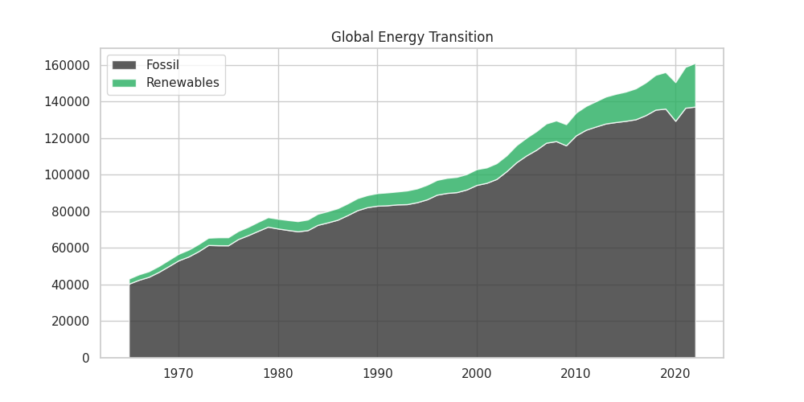
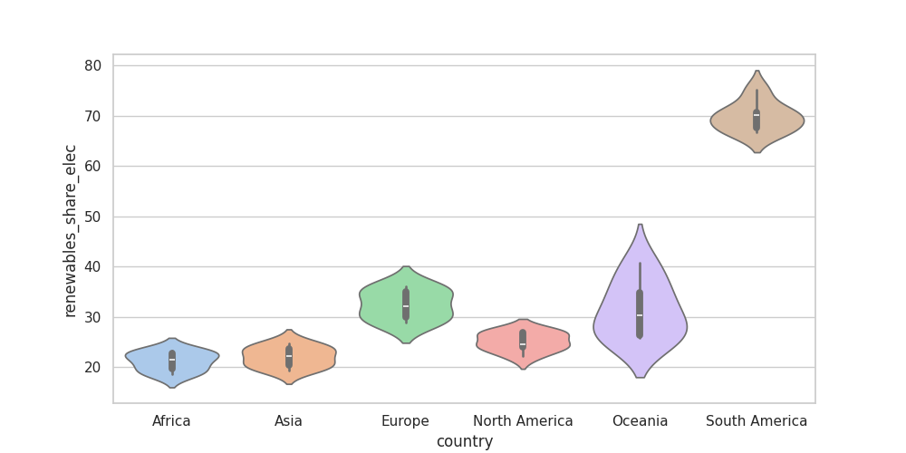
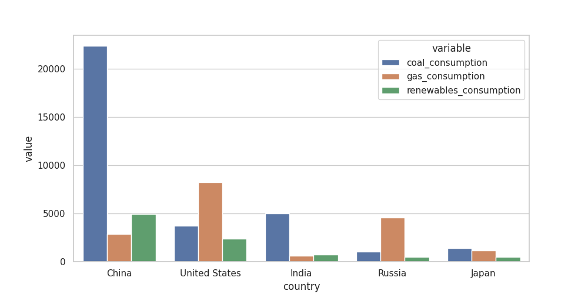

# World Energy Consumption Analysis - DATA 2005 Team Project

**Course:** DATA 2005 - Data-Centric Programming  
**Assessment:** Team Data Processing Project (20%)

## Team Members

| Name | Role | GitHub |
|------|------|--------|
| [Darling Mota] | Data Engineer | [@darlingmota] |
| [Titas Utrya] | Data Analyst | [@titas3012] |
| [Prosper Umeh] | Visualization Lead | [@pruber] |
| [Nischal Rana] | Documentation Lead | [@NischalRana29] |

## Project Description

This project processes the Our World in Data (OWID) World Energy Consumpiton dataset to analyse how the global energy mix has shifted between fossil fuels and low carbon sources. The pipeline loads the raw country level annual data, drops sparse indicators, filters to the modern year(2000+), engineers four energy mix share features, and produces a cleaned dataset ready for statistical analysis and visualization. Final outputs are exported in CSV and JSON formats. 

## Dataset

- **Name:** [World Energy Consumption]
- **Source:** [\[[Source URL](https://www.kaggle.com/datasets/pralabhpoudel/world-energy-consumption)\]](https://www.kaggle.com/datasets/pralabhpoudel/world-energy-consumption)
- **Size:** [~20,000+]
- **Format:** CSV/JSON


## Pipeline Overview

The project is organised as four cooperating modules in src/:

1. Data Loading (data_loading.py) — reads the raw CSV, runs structural validation (row/column counts, missing-value summary, duplicate detection, country and year coverage), and reports a high-level overview of the dataset.

2. Preprocessing (preprocessing.py) — drops columns with more than 70% missing values, filters to the modern era (year ≥ 2000), removes exact duplicates, removes rows missing the key energy columns, engineers four derived features (renewable_elec_share, coal_elec_share, nuclear_elec_share, fossil_renewable_ratio), selects a focused subset of relevant columns, and forward/backward fills remaining gaps within each country.

3. Analysis (analysis.py) — computes summary statistics, yearly/decadal/country aggregations, per-capita normalisation, z-score standardisation, energy-mix shares, peak-year detection, top-N consumers, anomaly detection (z-score > 3), and a correlation matrix across the main indicators. Most aggregations use pandas groupby with vectorised NumPy operations underneath.

4. Visualization (visualization.py) — produces a curated set of five figures, each covering a distinct analytical angle and using a different chart type: the global fossil-vs-renewables transition (stackplot), the energy mix of the top-five consumer countries (grouped bar), the regional distribution of renewables share in electricity (violin), the statistical shift in carbon intensity between 2000 and 2021 (KDE), and the divergent energy-per-capita trajectories of the world's regions (faceted line). Built with matplotlib and seaborn, reading from the raw OWID CSV so that pre-2000 data remains available for historical context.


## Repository Structure 

DATA2005-TEAM-PROJECT/

|__ data/
| |__processed/
| | |-- .gitkeep
| | |__ owid-energy-clean.csv
| |__raw/
| | |-- .gitkeep
| | |__ oid-energy-data.csv

|__ outputs/
| |__ figures/
| | |__ .gitkeep
| |__ reports/
| | |__ .gitkeep

|__ src
| |-- __init__.py
| |-- analysis.py
| |-- data_loading.py
| |-- main.py
| |-- preprocessing.py
| |__ visualization.py

|__ LINCENSE

|__ README.md  

## Setup
### Requirements

- Python >= 3.12
- pandas
- numpy
- matplotlib
- seaborn
- openpyxl

### Installation

Clone the repository and install dependencies:
```bash
git clone https://github.com/darlingmota/DATA2005-Team-Project.git
cd DATA2005-TEAM-PROJECT
python -m venv venv
source venv/bin/activate          # macOS / Linux
venv\Scripts\activate             # Windows
pip install pandas numpy matplotlib seaborn openpyxl
```


### Data Acquisition

Kaggle
1. Go to https://www.kaggle.com/datasets/pralabhpoudel/world-energy-consumption
2. Download World Energy Consumption.csv
3. Place it in data/raw/ and rename to owid-energy-data.csv 

## Usage
### Run the full data pipeline

From the project root, run the main pipeline to load, validate, clean, and export the dataset:

```bash
python src/main.py
```

This reads `data/raw/owid-energy-data.csv` and writes `data/processed/owid-energy-clean.csv`.

### Run the analysis module

```bash
python src/analysis.py
```

Computes summary statistics, anomaly detection, top-N consumers, and aggregations on the cleaned dataset, printing key results to the console.

### Generate the visualization

```bash
python src/visualization.py
```

Produces a set of figures saved to the working directory as PNG files, including the global energy transition, regional renewables shares, GDP vs low-carbon electricity, and the carbon-intensity distribution shift.


## Output files 

data/processed/owid-energy-clean.csv: Cleaned dataset, post-2000, with engineered features

outputs/figures/1_transition.png: Global fossil vs renewables consumption over time

outputs/figures/4_top5.png: Energy mix of the top-5 consumer countries

outputs/figures/6_violin.png: Regional distribution of renewables share in electricity

outputs/figures/7_carbon_kde.png: Carbon-intensity density: 2000 vs 2021

outputs/figures/9_facetgrid.png: Energy per capita by region, faceted over time


## Sample Outputs

A selection of figures produced by `visualization.py`. The full set lives in `outputs/figures/`.

### Global Energy Transition

The headline finding: global fossil-fuel consumption has continued to grow alongside renewables. Renewables are catching up but absolute fossil consumption has not yet declined.

<p align="center">
    
</p>

### Renewables Share of Electricity by Region

Distributions of renewables share across the post-2015 period. South America stands out at roughly 70% renewables, while most other regions cluster between 20% and 35%.

<p align="center">
    
</p>

### Energy Mix of Top-5 Consumers

The five largest energy consumers and how their mix differs. China is heavily coal-dependent, the US leans on gas, and renewables remain a small share for all five.

<p align="center">
    
</p>


## Engineered Features

renewable_elec_share: Renewables as % of total electricity generation

coal_elec_share: Coal as % of total electricity generation

nuclear_elec_share: Nuclear as % of total electricity generation

fossil_renewable_ratio: Fossil-fuel consumption ÷ renewables consumption

These features make it easier to compare countries on energy-mix composition rather than absolute consumption, which is dominated by population and GDP.

## License
This project is released under the terms of the LICENSE file in the project root.